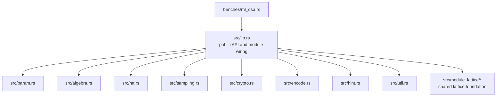

# ML-DSA Architecture

## Overview

This crate follows the architecture of the RustCrypto `ml-dsa` implementation referenced in `README.md`:

- Reference: <https://github.com/RustCrypto/signatures/tree/master/ml-dsa>
- Spec target: FIPS 204 (ML-DSA)

The design goal is to keep the same module boundaries as upstream so algorithm code can be ported and reviewed with minimal structural drift.

## RustCrypto Reference Architecture

RustCrypto organizes ML-DSA into these core modules under `ml-dsa/src/`:

- `lib.rs`: API types and algorithm orchestration.
- `param.rs`: parameter traits, type-level sizes, and encoding size logic.
- `algebra.rs`: ring/vector polynomial arithmetic.
- `ntt.rs`: forward/inverse NTT operations.
- `sampling.rs`: `expand_a`, `expand_s`, `expand_mask`, `sample_in_ball`.
- `crypto.rs`: hash/XOF wrappers used by keygen/sign/verify flows.
- `encode.rs`: packing/encoding and range encoding helpers.
- `hint.rs`: `make_hint`, `use_hint`, hint pack/unpack.
- `pkcs8.rs`: optional PKCS#8 key encoding support.

At a flow level in upstream:

- Key generation is implemented through `KeyGen::from_seed` in `lib.rs`.
- Signing is centered on `SigningKey::raw_sign_mu` in `lib.rs`, with sampling + hint modules.
- Verification is centered on `VerifyingKey::raw_verify_mu` in `lib.rs`.

## This Repository Layout

## Mapping to RustCrypto

- **Directly mirrored module names:** `param`, `algebra`, `ntt`, `sampling`, `crypto`, `encode`, `hint`.
- **Orchestration model:** `lib.rs` is the integration point for keygen/sign/verify API types, matching upstream intent.
- **Shared lattice layer:** this repo currently keeps `module_lattice` internal; upstream consumes `module_lattice` as a separate dependency.
- **PKCS#8 integration:** RustCrypto has `src/pkcs8.rs`; this repo exposes `pkcs8` via features/dependencies but has not split a local `pkcs8.rs` module yet.

## Current State vs Target State

Implemented now:

- Public key/signature wrapper types in `src/lib.rs`.
- Parameter constants for ML-DSA-44/65/87 in `src/param.rs`.
- Module scaffolding for arithmetic/sampling/encoding/hints.
- Shared lattice foundation modules under `src/module_lattice/`.

Still to be completed to match RustCrypto behavior:

- Full key generation/signing/verification internals in `src/lib.rs`.
- Concrete algorithm implementations in the scheme modules.
- Byte-level encoding/decoding parity and full test-vector compatibility.

## Design Principles

- Keep module boundaries consistent with RustCrypto for easier porting and review.
- Separate parameter and encoding-size logic from arithmetic and protocol flow.
- Keep high-level API stable while filling in algorithm internals.
- Preserve optional feature boundaries (`rand_core`, `pkcs8`, `zeroize`, `alloc`).
