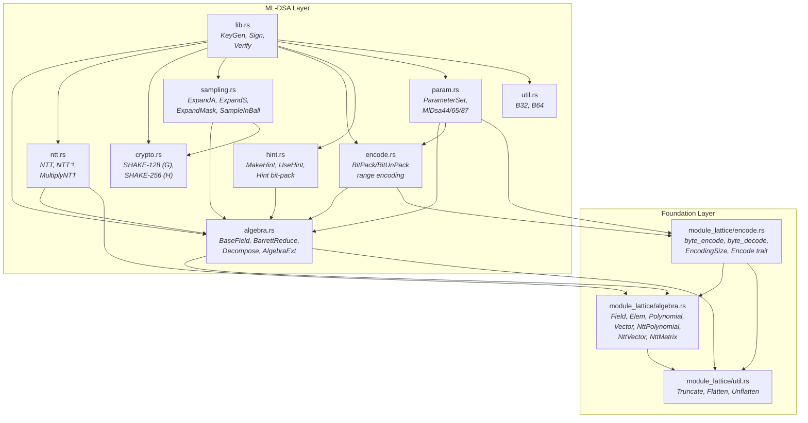
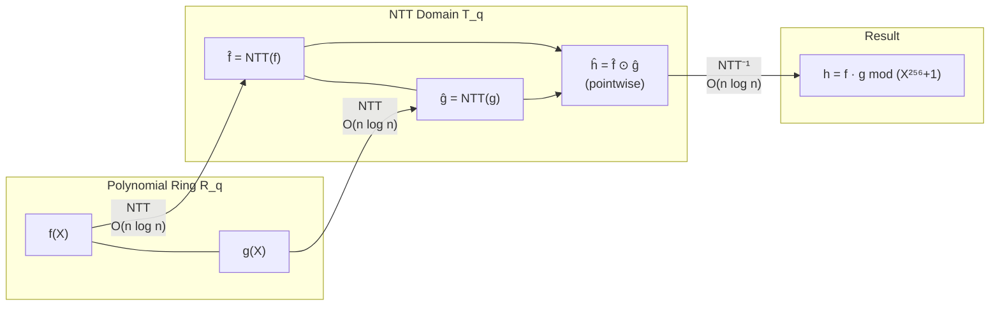
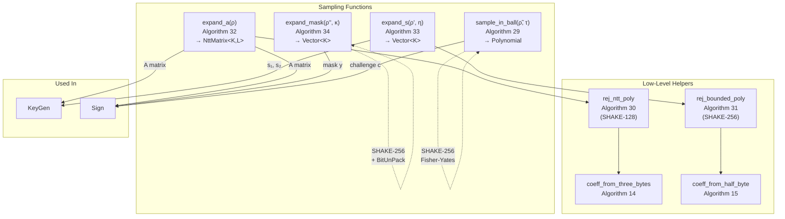
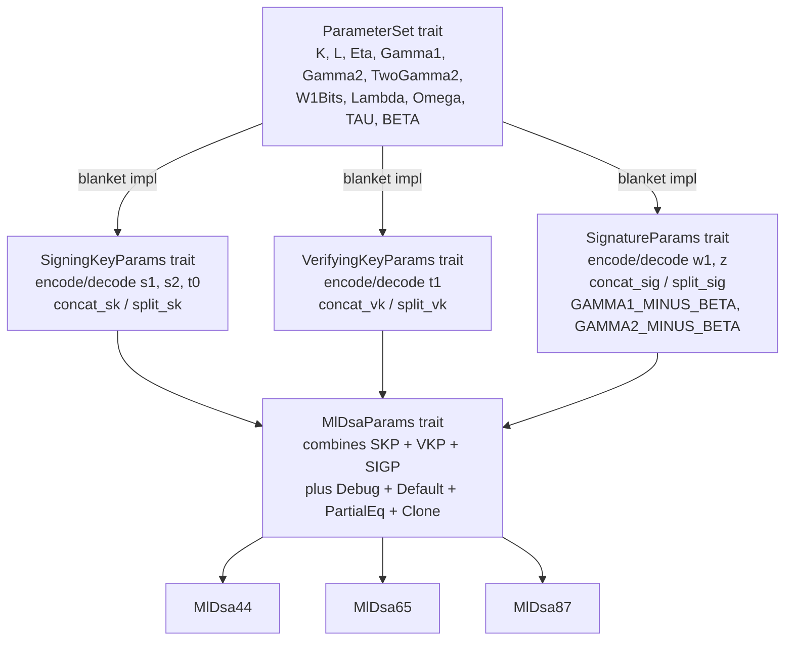
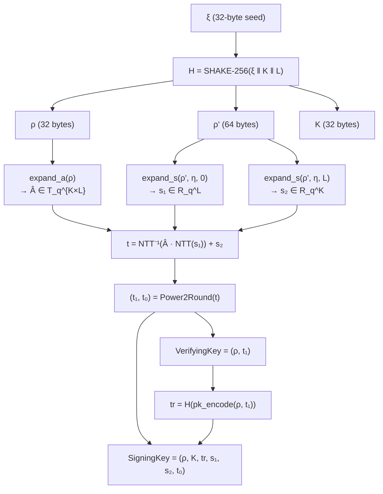
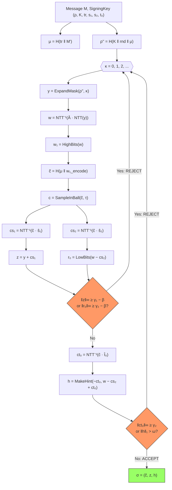
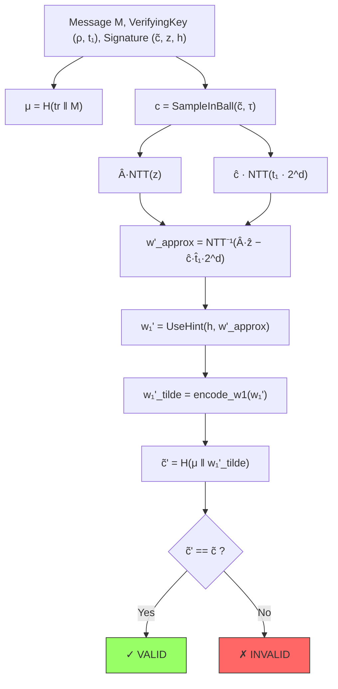
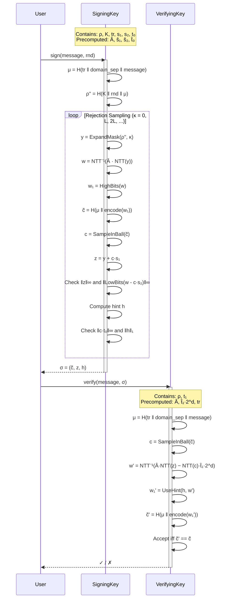
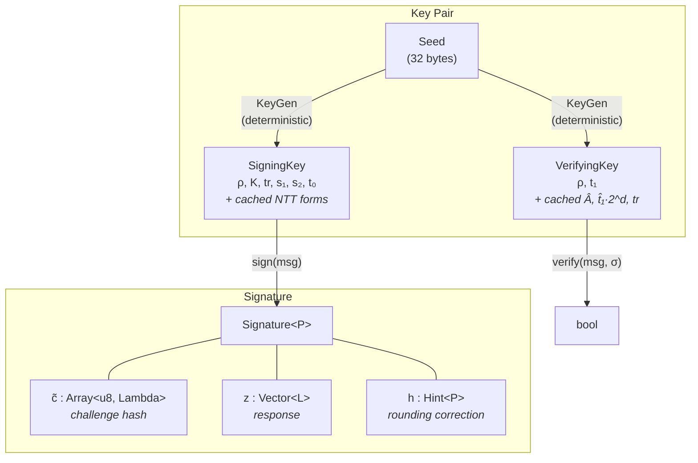

# ML-DSA Implementation Guide

This document provides a detailed walkthrough of how the `src/` directory implements the **ML-DSA** (Module-Lattice-Based Digital Signature Algorithm) standard defined by [FIPS 204](https://csrc.nist.gov/pubs/fips/204/final). ML-DSA is the standardized form of CRYSTALS-Dilithium, a post-quantum digital signature scheme based on the hardness of the Module Learning With Errors (M-LWE) and Module Short Integer Solution (M-SIS) problems over polynomial lattices.

---

## Table of Contents

1. [High-Level Architecture](#1-high-level-architecture)
2. [Module Dependency Graph](#2-module-dependency-graph)
3. [Foundation Layer: `module_lattice/`](#3-foundation-layer-module_lattice)
   - 3.1 [Field Arithmetic (`module_lattice/algebra.rs`)](#31-field-arithmetic-module_latticealgebras)
   - 3.2 [Polynomial Encoding (`module_lattice/encode.rs`)](#32-polynomial-encoding-module_latticeencoders)
   - 3.3 [Utility Primitives (`module_lattice/util.rs`)](#33-utility-primitives-module_latticeutilrs)
4. [ML-DSA Algebra (`algebra.rs`)](#4-ml-dsa-algebra-algebrars)
5. [Number Theoretic Transform (`ntt.rs`)](#5-number-theoretic-transform-nttrs)
6. [Cryptographic Hash Functions (`crypto.rs`)](#6-cryptographic-hash-functions-cryptors)
7. [Sampling Algorithms (`sampling.rs`)](#7-sampling-algorithms-samplingrs)
8. [Encoding & Bit Packing (`encode.rs`)](#8-encoding--bit-packing-encoders)
9. [Hint System (`hint.rs`)](#9-hint-system-hintrs)
10. [Parameter Sets (`param.rs`)](#10-parameter-sets-paramrs)
11. [Core Protocol (`lib.rs`)](#11-core-protocol-librs)
    - 11.1 [Key Generation](#111-key-generation)
    - 11.2 [Signing](#112-signing)
    - 11.3 [Verification](#113-verification)
12. [Data Flow Diagrams](#12-data-flow-diagrams)

---

## 1. High-Level Architecture

The implementation is organized as a layered architecture. A reusable **module-lattice** foundation provides generic algebraic structures, on top of which ML-DSA-specific logic is built. The overall flow mirrors the three core algorithms of FIPS 204:

| FIPS 204 Algorithm | Function | Description |
|---|---|---|
| Algorithm 6 | `KeyGen::from_seed` | Generate a signing/verifying key pair from a 32-byte seed |
| Algorithm 7 | `SigningKey::sign_internal` | Produce a signature over a message (rejection sampling loop) |
| Algorithm 8 | `VerifyingKey::verify_internal` | Verify a signature against a message and public key |

Three parameter sets are supported, all sharing the same code via Rust's trait system:

| Parameter Set | Security Level | `(K, L)` | Signature Size |
|---|---|---|---|
| `MlDsa44` | Category 2 (128-bit) | (4, 4) | 2,420 bytes |
| `MlDsa65` | Category 3 (192-bit) | (6, 5) | 3,309 bytes |
| `MlDsa87` | Category 5 (256-bit) | (8, 7) | 4,627 bytes |

---

## 2. Module Dependency Graph

The following diagram shows how each source module depends on the others. Arrows point from a module to its dependencies.



---

## 3. Foundation Layer: `module_lattice/`

The `module_lattice/` sub-crate provides generic algebraic structures that are shared between ML-DSA and ML-KEM. It is parameterized by a `Field` trait, making it reusable across different moduli.

### 3.1 Field Arithmetic (`module_lattice/algebra.rs`)

The `Field` trait defines a prime-order finite field with efficient modular arithmetic:

```rust
pub trait Field: Copy + Default + Debug + PartialEq {
    type Int: PrimInt + ...;   // e.g., u32
    type Long: PrimInt + ...;  // e.g., u64  (for products)
    type LongLong: PrimInt;    // e.g., u128 (for Barrett reduction)

    const Q: Self::Int;        // The prime modulus

    fn small_reduce(x: Self::Int) -> Self::Int;   // x mod Q for x < 2Q
    fn barrett_reduce(x: Self::Long) -> Self::Int; // x mod Q via Barrett
}
```

The `define_field!` macro instantiates a concrete field. For ML-DSA:

```rust
define_field!(BaseField, u32, u64, u128, 8_380_417);
// Q = 2^23 - 2^13 + 1 = 8,380,417
```

**Barrett reduction** avoids expensive hardware division by precomputing a fixed-point reciprocal:

```
x mod Q  ≈  x − ⌊x · ⌊2^k / Q⌋ / 2^k⌋ · Q
```

where `k = 2 · (⌊log₂(Q)⌋ + 1) = 48`. The single multiplication + shift replaces division entirely.

**Algebraic types** are built as layers on `Elem<F>`:

```
Elem<F>           ─── a single element of Z_q
Polynomial<F>     ─── Array<Elem<F>, U256>  (ring R_q = Z_q[X]/(X^256+1))
Vector<F, K>      ─── Array<Polynomial<F>, K>
NttPolynomial<F>  ─── Array<Elem<F>, U256>  (NTT-domain representation)
NttVector<F, K>   ─── Array<NttPolynomial<F>, K>
NttMatrix<F, K, L>── Array<NttVector<F, L>, K>  (K×L matrix of NTT polynomials)
```

All types support addition, subtraction, negation, and scalar multiplication via operator overloading. Multiplication of `NttPolynomial` values is delegated to a `MultiplyNtt` trait implemented downstream.

### 3.2 Polynomial Encoding (`module_lattice/encode.rs`)

This module implements **SimpleBitPack** (FIPS 204, Algorithm 16) and **SimpleBitUnpack** (Algorithm 18): packing 256 polynomial coefficients into a compact byte array using a specified number of bits per coefficient.

The encoding process for `D` bits per coefficient:

```
╔══════════════════════════════════════════════════════════════╗
║  Input: 256 coefficients, each in [0, 2^D - 1]              ║
║                                                              ║
║  Step 1: Group coefficients into chunks of ValueStep         ║
║          (ValueStep = lcm(D,8) / D)                          ║
║                                                              ║
║  Step 2: Pack each chunk into a 128-bit integer via          ║
║          x |= coeff[j] << (D * j)                           ║
║                                                              ║
║  Step 3: Write ByteStep bytes from x in little-endian        ║
║          (ByteStep = lcm(D,8) / 8)                           ║
║                                                              ║
║  Output: D * 32 bytes                                        ║
╚══════════════════════════════════════════════════════════════╝
```

All sizes are computed at compile time using `typenum`, ensuring zero-cost abstraction.

### 3.3 Utility Primitives (`module_lattice/util.rs`)

Provides safe wrappers around low-level operations:

- **`Truncate<T>`** — safely truncate integers (e.g., `u128 → u32`) by masking high bits.
- **`Flatten`** — convert `Array<Array<T, M>, N>` to `Array<T, M*N>` via pointer cast (same memory layout guaranteed by Rust).
- **`Unflatten`** — the inverse: split a flat array into equal-sized sub-arrays.

---

## 4. ML-DSA Algebra (`algebra.rs`)

This module specializes the generic module-lattice algebra for ML-DSA's field (`Q = 8,380,417`) and adds the ML-DSA-specific decomposition algorithms.

**Type aliases** provide convenient names:

```rust
type Elem       = module_lattice::algebra::Elem<BaseField>;       // Z_q element
type Polynomial = module_lattice::algebra::Polynomial<BaseField>; // R_q polynomial
type Vector<K>  = module_lattice::algebra::Vector<BaseField, K>;  // vector of K polynomials
// ... and NTT variants
```

### Key Algorithms

**`BarrettReduce`** (for arbitrary compile-time moduli M):

```rust
// Reduce x modulo M, where x < M^2
fn reduce(x: u32) -> u32 {
    let quotient = (x as u64 * MULTIPLIER) >> SHIFT;
    let remainder = x as u64 - quotient * M;
    if remainder < M { remainder } else { remainder - M }
}
```

**`ConstantTimeDiv`** — constant-time division `x / M` using Barrett's method. Critical for avoiding timing side-channels during signing:

```rust
fn ct_div(x: u32) -> u32 {
    ((x as u64 * CT_DIV_MULTIPLIER) >> 48) as u32
}
```

**`Decompose`** (FIPS 204, Algorithm 36) — splits a field element `r` into `(r₁, r₀)` such that `r = r₁ · (2γ₂) + r₀` with `r₀` centered:

```rust
fn decompose<TwoGamma2>(self) -> (Elem, Elem) {
    let r0 = self.mod_plus_minus::<TwoGamma2>();
    if self - r0 == Elem::new(Q - 1) {
        (Elem::new(0), r0 - Elem::new(1))
    } else {
        let r1 = Elem::new(TwoGamma2::ct_div((self - r0).0));
        (r1, r0)
    }
}
```

**`Power2Round`** (Algorithm 35) — decomposes `r` into `(r₁, r₀)` where `r₀ = r mod±(2^d)` and `r₁ = (r − r₀) / 2^d`. Used during key generation to split `t` into `t₁` (public) and `t₀` (private).

**`AlgebraExt`** trait unifies these operations across `Elem`, `Polynomial`, and `Vector<K>`:

```rust
pub(crate) trait AlgebraExt: Sized {
    fn mod_plus_minus<M: Unsigned>(&self) -> Self;  // centered reduction
    fn infinity_norm(&self) -> Int;                 // max |coeff| under centered repr.
    fn power2round(&self) -> (Self, Self);           // Algorithm 35
    fn high_bits<TwoGamma2: Unsigned>(&self) -> Self; // Algorithm 37
    fn low_bits<TwoGamma2: Unsigned>(&self) -> Self;  // Algorithm 38
}
```

---

## 5. Number Theoretic Transform (`ntt.rs`)

The NTT is the most performance-critical component. It converts polynomials from the ring `R_q = Z_q[X]/(X^256 + 1)` to the NTT algebra `T_q ≅ Z_q^256`, where **polynomial multiplication becomes pointwise multiplication** — reducing O(n²) to O(n log n).

### Precomputed Zeta Table

The primitive 512th root of unity `ζ = 1753` (mod Q) has its powers precomputed in bit-reversed order at compile time:

```rust
const ZETA_POW_BITREV: [Elem; 256] = {
    const ZETA: u64 = 1753;
    // ... computed via const evaluation
    // ZETA_POW_BITREV[i] = ζ^{BitRev₈(i)} mod Q
};
```

### Forward NTT (Algorithm 41)

The NTT uses 8 butterfly layers, each implemented as a const-generic function to ensure all loop bounds are compile-time constants (avoiding variable-time UDIV instructions):

```rust
fn ntt_layer<const LEN: usize, const ITERATIONS: usize>(
    w: &mut [Elem; 256], m: &mut usize
) {
    for i in 0..ITERATIONS {
        let start = i * 2 * LEN;
        *m += 1;
        let z = ZETA_POW_BITREV[*m];
        for j in start..(start + LEN) {
            let t = z * w[j + LEN];       // butterfly
            w[j + LEN] = w[j] - t;
            w[j]       = w[j] + t;
        }
    }
}

// Applied as 8 successive layers:
fn ntt(&self) -> NttPolynomial {
    let mut w = self.0.clone().into();
    let mut m = 0;
    ntt_layer::<128, 1>(&mut w, &mut m);   // layer 0: 1 group of 128
    ntt_layer::< 64, 2>(&mut w, &mut m);   // layer 1: 2 groups of 64
    ntt_layer::< 32, 4>(&mut w, &mut m);   // layer 2: 4 groups of 32
    ntt_layer::< 16, 8>(&mut w, &mut m);   // ...
    ntt_layer::<  8,16>(&mut w, &mut m);
    ntt_layer::<  4,32>(&mut w, &mut m);
    ntt_layer::<  2,64>(&mut w, &mut m);
    ntt_layer::<  1,128>(&mut w, &mut m);  // layer 7: 128 groups of 1
    NttPolynomial::new(w.into())
}
```

### Inverse NTT (Algorithm 42)

Reverses the butterfly layers and multiplies by `256⁻¹ mod Q = 8,347,681`:

```rust
fn ntt_inverse(&self) -> Polynomial {
    const INVERSE_256: Elem = Elem::new(8_347_681);
    let mut w = self.0.clone().into();
    let mut m = 256;
    ntt_inverse_layer::<  1,128>(&mut w, &mut m);
    // ... (8 layers in reverse) ...
    ntt_inverse_layer::<128,  1>(&mut w, &mut m);
    INVERSE_256 * &Polynomial::new(w.into())
}
```

### NTT Multiplication (Algorithm 45)

For ML-DSA, pointwise multiplication in `T_q`:

```rust
impl MultiplyNtt for BaseField {
    fn multiply_ntt(lhs: &NttPolynomial, rhs: &NttPolynomial) -> NttPolynomial {
        NttPolynomial::new(
            lhs.0.iter().zip(rhs.0.iter())
                 .map(|(&x, &y)| x * y)  // pointwise
                 .collect()
        )
    }
}
```



---

## 6. Cryptographic Hash Functions (`crypto.rs`)

ML-DSA uses SHAKE (Extendable Output Functions) as its sole hash primitive. The `ShakeState` enum wraps the `sha3` crate and enforces the absorb-then-squeeze protocol:

```rust
pub enum ShakeState<Shake> {
    Absorbing(Shake),                    // can call absorb()
    Squeezing(<Shake as ExtendableOutput>::Reader), // can call squeeze()
}
```

Two aliases match FIPS 204 notation:

```rust
pub type G = ShakeState<Shake128>;  // SHAKE-128, used in ExpandA (Algorithm 32)
pub type H = ShakeState<Shake256>;  // SHAKE-256, used everywhere else
```

Usage pattern throughout the codebase:

```rust
let mut ctx = H::default();
ctx.absorb(&seed);           // feed input
ctx.absorb(&extra_data);
let output: B64 = ctx.squeeze_new_array();  // extract output
```

---

## 7. Sampling Algorithms (`sampling.rs`)

Sampling converts hash output into algebraic objects with specific distributions. All sampling is deterministic given the seed, ensuring reproducibility.



### `expand_a` (Algorithm 32)

Generates the public matrix `Â ∈ T_q^{K×L}` from seed `ρ`. Each entry is sampled via rejection from SHAKE-128 output, accepting 3-byte chunks that decode to values < Q:

```rust
pub(crate) fn expand_a<K, L>(rho: &[u8]) -> NttMatrix<K, L> {
    NttMatrix::new(Array::from_fn(|r| {
        NttVector::new(Array::from_fn(|s| {
            rej_ntt_poly(rho, r as u8, s as u8) // Algorithm 30
        }))
    }))
}
```

### `expand_s` (Algorithm 33)

Samples short secret vectors `s₁, s₂` with coefficients bounded by `η` using rejection sampling from SHAKE-256:

```rust
pub(crate) fn expand_s<K>(rho: &[u8], eta: Eta, base: usize) -> Vector<K> {
    Vector::new(Array::from_fn(|r| {
        rej_bounded_poly(rho, eta, (r + base) as u16) // Algorithm 31
    }))
}
```

### `sample_in_ball` (Algorithm 29)

Creates a sparse polynomial `c` with exactly `τ` nonzero coefficients (all ±1), used as the signature challenge. Uses a Fisher-Yates-style permutation driven by SHAKE-256:

```rust
pub(crate) fn sample_in_ball(rho: &[u8], tau: usize) -> Polynomial {
    let mut c = Polynomial::default();
    let mut ctx = H::default();
    ctx.absorb(rho);
    let mut s = [0u8; 8];
    ctx.squeeze(&mut s);  // sign bits

    for i in (256 - tau)..256 {
        // squeeze random index j ∈ [0, i]
        // swap c[i] and c[j], set c[j] = ±1
    }
    c
}
```

---

## 8. Encoding & Bit Packing (`encode.rs`)

This module extends the base `module_lattice::encode` with **range encoding** for signed values. While `SimpleBitPack` encodes values in `[0, b]`, ML-DSA needs to encode values in `[-a, b]`.

The key insight: map `w ∈ [-a, b]` to `b - w ∈ [0, a + b]`, then use SimpleBitPack.

```rust
// Algorithm 17: BitPack
fn pack(&self) -> Array<u8, PackedSize> {
    let shifted = self.0.iter().map(|w| b - *w).collect();  // shift to [0, a+b]
    Encode::<RangeEncodingBits>::encode(&shifted)            // simple bit-pack
}

// Algorithm 17: BitUnPack
fn unpack(enc: &Array<u8, PackedSize>) -> Self {
    let decoded = Encode::<RangeEncodingBits>::decode(enc);  // simple bit-unpack
    decoded.0.iter().map(|z| b - *z).collect()               // shift back to [-a, b]
}
```

**Usage across ML-DSA components:**

| Data | Range `[-a, b]` | Bits/coeff | Used for |
|---|---|---|---|
| `s₁, s₂` | `[-η, η]` | 3 (η=2) or 4 (η=4) | Secret key encoding |
| `t₀` | `[-(2¹² - 1), 2¹²]` | 13 | Secret key low bits |
| `z` | `[-(γ₁-1), γ₁]` | 18 or 20 | Signature response |
| `t₁` | `[0, 2¹⁰-1]` | 10 | Public key (SimpleBitPack) |
| `w₁` | `[0, 43]` or `[0, 15]` | 6 or 4 | High-order bits for challenge |

---

## 9. Hint System (`hint.rs`)

The hint `h` is a compact bitfield that corrects rounding errors during verification. It allows the verifier to recover the exact `w₁` value without knowing the secret key.

### `MakeHint` (Algorithm 39)

Determines whether adding `z` to `r` changes the high-order bits:

```rust
pub fn make_hint<TwoGamma2>(z: Elem, r: Elem) -> bool {
    let r1 = r.high_bits::<TwoGamma2>();
    let v1 = (r + z).high_bits::<TwoGamma2>();
    r1 != v1  // true if high bits changed
}
```

### `UseHint` (Algorithm 40)

Given a hint bit, corrects the high-order bits of `r`:

```rust
pub fn use_hint<TwoGamma2>(h: bool, r: Elem) -> Elem {
    let (r1, r0) = r.decompose::<TwoGamma2>();
    if !h { return r1; }
    // adjust r1 by ±1 based on the sign of r0
    if r0.0 > 0 && r0.0 <= gamma2 {
        Elem::new((r1.0 + 1) % m)
    } else {
        Elem::new((r1.0 + m - 1) % m)
    }
}
```

### `Hint<P>` Struct

Wraps hint bits for an entire vector and provides efficient bit-packing:

```rust
pub struct Hint<P: SignatureParams>(
    pub Array<Array<bool, U256>, P::K>  // K polynomials × 256 coefficients
);
```

The compact encoding uses `ω + K` bytes: the first `ω` bytes store the indices of set bits, and the last `K` bytes store cumulative counts per polynomial.

---

## 10. Parameter Sets (`param.rs`)

All security-level-dependent constants are captured in a trait hierarchy, enabling a single generic implementation to serve all three ML-DSA variants.



The concrete parameter values (from FIPS 204, Tables 1-2):

```rust
impl ParameterSet for MlDsa44 {
    type K = U4;   type L = U4;   type Eta = U2;
    type Gamma1 = Shleft<U1, U17>;             // 2^17 = 131,072
    type Gamma2 = Quot<QMinus1, U88>;           // (Q-1)/88 = 95,232
    type Lambda = U32;  type Omega = U80;
    const TAU: usize = 39;
    // BETA = TAU * ETA = 78
}

impl ParameterSet for MlDsa65 {
    type K = U6;   type L = U5;   type Eta = U4;
    type Gamma1 = Shleft<U1, U19>;             // 2^19 = 524,288
    type Gamma2 = Quot<QMinus1, U32>;           // (Q-1)/32 = 261,888
    type Lambda = U48;  type Omega = U55;
    const TAU: usize = 49;
    // BETA = TAU * ETA = 196
}

impl ParameterSet for MlDsa87 {
    type K = U8;   type L = U7;   type Eta = U2;
    type Gamma1 = Shleft<U1, U19>;
    type Gamma2 = Quot<QMinus1, U32>;
    type Lambda = U64;  type Omega = U75;
    const TAU: usize = 60;
    // BETA = TAU * ETA = 120
}
```

The blanket implementations compute encoding sizes at the type level. For example, the signing key size is:

```
|sk| = 32 (ρ) + 32 (K) + 64 (tr) + |s₁| + |s₂| + |t₀|
```

where each component size is derived from the parameter set's encoding parameters. All sizes are verified at compile time to match FIPS 204, Table 2.

---

## 11. Core Protocol (`lib.rs`)

### 11.1 Key Generation

**Algorithm 6: `ML-DSA.KeyGen_internal`**



The core implementation:

```rust
fn from_seed(xi: &Seed) -> KeyPair<P> {
    // Derive seeds via SHAKE-256
    let mut h = H::default();
    h.absorb(xi);
    h.absorb(&[P::K::U8]);
    h.absorb(&[P::L::U8]);
    let rho: B32 = h.squeeze_new_array();
    let rhop: B64 = h.squeeze_new_array();
    let K: B32 = h.squeeze_new_array();

    // Sample secret vectors and public matrix
    let A_hat = expand_a::<P::K, P::L>(&rho);
    let s1 = expand_s::<P::L>(&rhop, P::Eta::ETA, 0);
    let s2 = expand_s::<P::K>(&rhop, P::Eta::ETA, P::L::USIZE);

    // Compute t = A·s1 + s2
    let t = &(&A_hat * &s1.ntt()).ntt_inverse() + &s2;

    // Split into public (t1) and private (t0) parts
    let (t1, t0) = t.power2round();

    KeyPair { signing_key, verifying_key, seed: xi.clone() }
}
```

### 11.2 Signing

**Algorithm 7: `ML-DSA.Sign_internal`** — the heart of the scheme, featuring a **rejection sampling loop**:



Key excerpt from the rejection sampling loop:

```rust
pub fn sign_internal(&self, Mp: &[&[u8]], rnd: &B32) -> Signature<P> {
    let mu = MuBuilder::internal(&self.tr, Mp);

    // Derive private random seed ρ''
    let mut rhopp_ctx = H::default();
    rhopp_ctx.absorb(&self.K);
    rhopp_ctx.absorb(rnd);     // deterministic: rnd = 0; randomized: random 32 bytes
    rhopp_ctx.absorb(&mu);
    let rhopp: B64 = rhopp_ctx.squeeze_new_array();

    // Rejection sampling loop
    for kappa in (0..u16::MAX).step_by(P::L::USIZE) {
        let y = expand_mask::<P::L, P::Gamma1>(&rhopp, kappa);
        let w = (&self.A_hat * &y.ntt()).ntt_inverse();
        let w1 = w.high_bits::<P::TwoGamma2>();

        // Compute challenge
        let w1_tilde = P::encode_w1(&w1);
        let mut c_ctx = H::default();
        c_ctx.absorb(&mu);
        c_ctx.absorb(&w1_tilde);
        let c_tilde: Array<u8, P::Lambda> = c_ctx.squeeze_new_array();
        let c = sample_in_ball(&c_tilde, P::TAU);
        let c_hat = c.ntt();

        // Compute response z and check norms
        let z = &y + &(&c_hat * &self.s1_hat).ntt_inverse();
        let r0 = (&w - &(&c_hat * &self.s2_hat).ntt_inverse())
                     .low_bits::<P::TwoGamma2>();

        if z.infinity_norm() >= P::GAMMA1_MINUS_BETA
            || r0.infinity_norm() >= P::GAMMA2_MINUS_BETA
        { continue; }  // REJECT: norms too large

        // Compute hint
        let ct0 = (&c_hat * &self.t0_hat).ntt_inverse();
        let h = Hint::<P>::new(&(-&ct0), &(&(&w - &cs2) + &ct0));

        if ct0.infinity_norm() >= P::Gamma2::U32
            || h.hamming_weight() > P::Omega::USIZE
        { continue; }  // REJECT: hint too large

        return Signature { c_tilde, z: z.mod_plus_minus::<SpecQ>(), h };
    }
}
```

### 11.3 Verification

**Algorithm 8: `ML-DSA.Verify_internal`** — reconstructs `w₁'` and checks the challenge:



```rust
fn raw_verify_mu(&self, mu: &B64, sigma: &Signature<P>) -> bool {
    let c = sample_in_ball(&sigma.c_tilde, P::TAU);

    // Reconstruct w'_approx = A·z - c·t1·2^d
    let Az_hat  = &self.A_hat * &sigma.z.ntt();
    let ct1_hat = &c.ntt() * &self.t1_2d_hat;
    let wp_approx = (&Az_hat - &ct1_hat).ntt_inverse();

    // Apply hints to recover w1'
    let w1p = sigma.h.use_hint(&wp_approx);

    // Recompute challenge and compare
    let w1p_tilde = P::encode_w1(&w1p);
    let mut cp_ctx = H::default();
    cp_ctx.absorb(mu);
    cp_ctx.absorb(&w1p_tilde);
    let cp_tilde: Array<u8, P::Lambda> = cp_ctx.squeeze_new_array();

    sigma.c_tilde == cp_tilde  // accept iff challenges match
}
```

---

## 12. Data Flow Diagrams

### Complete Signing and Verification Pipeline



### Key Data Structure Relationships



### Source File Responsibility Map

```mermaid
graph LR
    subgraph "What each file is responsible for"
        direction TB
        F1["<b>module_lattice/algebra.rs</b><br/>Generic: Field, Elem, Polynomial,<br/>Vector, NttPolynomial, Matrix"]
        F2["<b>module_lattice/encode.rs</b><br/>Generic: bit-packing [0, b]"]
        F3["<b>module_lattice/util.rs</b><br/>Generic: Truncate, Flatten"]
        F4["<b>algebra.rs</b><br/>ML-DSA field (Q=8380417),<br/>Decompose, Power2Round,<br/>HighBits, LowBits,<br/>Barrett, ConstTimeDiv"]
        F5["<b>ntt.rs</b><br/>NTT forward/inverse,<br/>pointwise multiplication,<br/>precomputed zeta table"]
        F6["<b>crypto.rs</b><br/>SHAKE-128/256 wrapper,<br/>absorb-then-squeeze"]
        F7["<b>sampling.rs</b><br/>ExpandA, ExpandS, ExpandMask,<br/>SampleInBall, rejection sampling"]
        F8["<b>encode.rs</b><br/>Signed range encoding [-a, b],<br/>BitPack / BitUnPack"]
        F9["<b>hint.rs</b><br/>MakeHint, UseHint,<br/>hint bit-packing"]
        F10["<b>param.rs</b><br/>MlDsa44/65/87 constants,<br/>ParameterSet trait hierarchy,<br/>key/sig encoding logic"]
        F11["<b>lib.rs</b><br/>KeyGen, Sign, Verify,<br/>KeyPair, SigningKey,<br/>VerifyingKey, Signature,<br/>signature crate traits"]
    end
```



---

*This document describes the implementation as of the current codebase. For the mathematical foundations behind module lattices, NTT, and the ML-DSA construction, see [FIPS 204](https://csrc.nist.gov/pubs/fips/204/final) and the companion documents `docs/lattice.pdf` and `docs/ntt.pdf`.*
